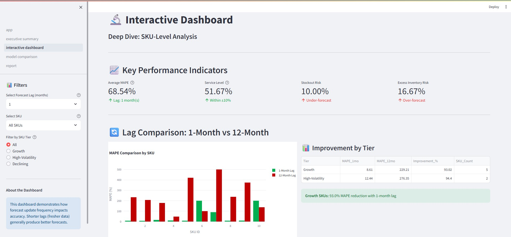

# Tesla Demand Forecasting Dashboard

## Objective

Develop a dynamic and interactive dashboard to provide Tesla’s demand planning team with actionable insights on forecast accuracy, business impact, and model performance. The goal is to support precise inventory planning, reduce excess inventory costs, and improve service levels through data-driven decisions.

## Detailed Demo Video


Demo Video Link: https://drive.google.com/file/d/1INgqyusu2Y0539PtL4s7Qh795TXvVdcL/view?usp=sharing

## Detailed Report
[Check Detailed Report Here](docs/Tesla_Demand_Forecasting_Report.docx)


## Approach

* Use five years of weekly sales data for ten representative Tesla SKUs exhibiting diverse growth and seasonality patterns.
* Generate forecasts for the period **January 2024 to June 2024**, simulating real product launch and planning cycles.
* Benchmark three forecasting models: **Moving Average** (baseline), **Exponential Smoothing** (industry standard), and **SARIMAX** (advanced statistical model).
* Simulate data availability lags of 1, 3, 6, and 12 months to understand the impact of data recency.
* Calculate comprehensive KPIs including accuracy metrics (**MAPE**, **MAE**, **RMSE**, **Bias**), business impact metrics (**stockout risk**, **excess inventory**, **service level**), and lag-based comparative improvements.

## Features

* Interactive filtering by **SKU**, **model**, **lag**, and **tier**.
* Visualizations of KPI performance via **comparative bar charts**, **heatmaps**, and **time series forecasts**.
* Executive summary and model comparison pages to support quick decision-making.
* Exportable KPI and model comparison data in **CSV format**.
* Dashboard implemented using **Streamlit** for ease of deployment within Tesla’s analytics stack.

## Forecasting Models and Comparisons

* **Moving Average** serves as a trusted operational baseline.
* **Exponential Smoothing** achieves the best overall accuracy (12.16% MAPE).
* **SARIMAX** excels in short-lag forecasting for growth SKUs but has higher errors overall.
* All models struggle with **declining SKUs**, indicating need for manual review or overrides.
* All models were applied to every SKU and scenario, following best-in-class automotive OEM forecasting standards.

## KPI Highlights (Actual Results)

| Tier            | Lag (months) | MAPE (%) | Service Level (%) (±10%) |
| --------------- | ------------ | -------- | ------------------------ |
| Growth          | 1            | 8.61     | 70.00                    |
| Growth          | 12           | 229.21   | 20.00                    |
| High-Volatility | 1            | 12.44    | 50.00                    |
| High-Volatility | 12           | 276.35   | 25.00                    |
| Declining       | 1            | 377.39   | 22.22                    |

Average improvement from 12-month to 1-month lag is approximately **93% reduction in MAPE** for growth SKUs (example: 8.25% vs 233.42%).

## KPI Metrics – What They Reveal, and Why

Key business and statistical metrics quantified for every forecast:

* **MAPE (Mean Absolute Percentage Error):** Relative error—priority for both low and high-volume SKUs. Calculated MAPE varies by tier and lag, e.g., Growth SKUs show 8.61% MAPE at 1-mo lag, rising to 229.21% at 12-mo lag.
* **MAE (Mean Absolute Error):** Impact in physical units (important for production).
* **RMSE:** Penalizes large deviations—important for buffer sizing.
* **Bias:** Shows systematic over/underestimation; links errors to operational risks (stockouts/excess).
* **Service Level (% within ±10% actual):** Direct measure of forecast quality—maps to Tesla’s business SLAs. For Growth SKUs, service level is 70% at 1-mo lag, decreasing to 20% at 12-mo lag.
* **Stockout & Excess Risk:** Track frequency of forecast misses causing real business loss.

Together, these KPIs provide a multidimensional view of forecast reliability—enabling planners to quantify not just accuracy, but business risk.

## How To Run

### Clone the Repository

```bash
git clone https://github.com/yourgithubusername/Tesla_Demand_Forecasting_Dashboard.git
cd Tesla_Demand_Forecasting_Dashboard
```

### Set Up the Environment

```bash
python -m venv venv
.\venv\Scripts\activate  # For Windows PowerShell
pip install -r requirements.txt
```

### Run Preprocessing, Modeling, and Evaluation Scripts

```bash
py src\data_preprocessing.py
py src\model_training.py
py src\baseline_models.py
py src\model_comparision.py
py src\kpi_calculation.py
```

### Launch Dashboard

```bash
streamlit run dashboard/app.py
```

### The dashboard includes:

* Executive Summary Page
* Interactive Forecast Dashboard
* Model Comparison Visualizations with filters for SKU, model type, and lag.

## Report

See the `docs/Report.md` file for a comprehensive analysis covering:

* Dataset overview and SKU segmentation rationale
* Model choices and forecast update frequency testing
* Detailed KPI metrics with business interpretation
* Visual analysis and insights on forecast accuracy and risk
* Business recommendations with quantified expected savings
* Roadmap for next phases and continuous improvement

## Final Summary

This integrated methodology demonstrates how Tesla can operationalize data recency analysis to continuously refine forecasting agility, ensuring inventory and production stay precisely aligned with real demand.

---
